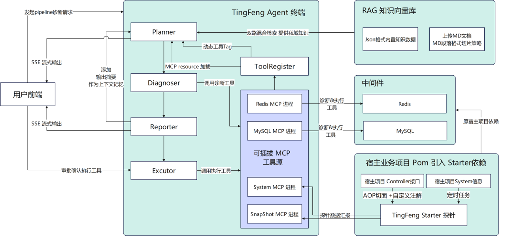

# TingFeng (听风) &middot; [](https://adoptium.net/) [](https://spring.io/projects/spring-boot) [](LICENSE)

> **轻量级智能运维 Agent — 引入 POM 依赖，用自然语言诊断 Redis / MySQL / JVM**

听风 (TingFeng) 是一个基于 LangChain4j 的 AIOps 智能体，支持"诊断 → 决策 → 执行"完整闭环。业务项目只需引入 `tingfeng-starter` 依赖，零侵入采集数据；Agent 独立部署，无需绑定业务代码。

---

## 项目特点

### 轻量级 · 低侵入

业务项目仅需引入 POM + 配置注解即可接入探针，不需改业务代码。Agent 作为独立进程运行，与业务服务解耦。

### 安全性

- **读写工具硬隔离**：Diagnoser LLM 仅能看到读工具，写操作（`redis_set_expire`、`redis_delete_key`）不注入 Agent，只能通过审批后 API 直调
- **全链路审计**：`tingfeng_tool_call_log` 记录每次工具调用，`tingfeng_execution_log` 记录每次执行操作
- **DUMP 备份**：删除 Key 前自动 `DUMP` → Base64，误删可 `RESTORE` 恢复
- **防御性超时**：所有工具调用 3 秒硬上限，日志写入 1 秒超时，故障时不压垮数据库
- **支持本地模型**：通过 Ollama 接入本地 LLM，数据不出企业内网

### 可用性

自建 JudgeAgent 评分体系对 Pipeline 和 Simple Chat 两种模式进行了 3 轮对比测试：

| 指标 | Simple Chat | Pipeline | 提升 |
|------|:--:|:--:|:--:|
| 诊断平均得分（满分 30） | 18.3 | **24.7** | **+35%** |
| Token 消耗 | ~5000 | ~10000 | 多 5 轮调用 |
| LLM 调用次数 | 2 次 | 10 次 | 结构化编排 |

Pipeline 模式得分更高，虽然 Token 是 Simple Chat 的两倍，但诊断质量提升显著且成本仍然极低（约 ¥0.01/次）。

### 扩展性

- **MCP 标准协议**：所有工具源基于 stdio MCP 通信，支持任意语言编写（Java / Python / Node.js）
- **工具热插拔**：运行时注册/注销工具源，Planner/Diagnoser/Reporter 自动重建，零重启
- **动态标签感知**：Planner 的 SystemMessage 根据当前可用工具源实时生成，新增工具后 LLM 自动认识新标签

---

## 系统架构



### Planner-Diagnoser-Reporter-Executor 分层解耦

```
用户问题
  │
  ▼
┌──────────────────────────────────────────────┐
│  Planner (规划师)                              │
│  ● 携带 RAG 检索知识                           │
│  ● 携带 Snapshot MCP Resource 探针快照数据      │
│  ● 动态感知当前可用工具源标签                    │
│  → 输出带 tag 的结构化排查计划                   │
└──────────────┬───────────────────────────────┘
               │ tags: ["redis"], ["mysql"], ...
        ┌──────┼──────┬──────┐
        ▼      ▼      ▼      ▼
┌──────────┐ ┌──────────┐ ┌──────────┐ ┌──────────┐
│Diagnoser │ │Diagnoser │ │Diagnoser │ │Diagnoser │
│(redis)   │ │(mysql)   │ │(cpu)     │ │(snapshot)│
│          │ │          │ │          │ │          │
│3 个读    │ │7 个读    │ │6 个读    │ │5 个读    │
│工具      │ │工具      │ │工具      │ │工具      │
└────┬─────┘ └────┬─────┘ └────┬─────┘ └────┬─────┘
     │            │            │            │
     └────────────┴────────────┴────────────┘
                    │
                    ▼
┌──────────────────────────────────────────────┐
│  Reporter (分析师)                             │
│  ● 汇总 Diagnoser 排查笔记                      │
│  ● 输出结构化诊断报告 + actions JSON             │
│  ● 摘要自动注入下一轮上下文记忆                   │
└──────────────┬───────────────────────────────┘
               │
               ▼
┌──────────────────────────────────────────────┐
│  Executor (执行器)                             │
│  ● 用户审批后直调 MCP 写工具                     │
│  ● 不经过 LLM，纯 API 调用                      │
│  ● 审计日志落库                                │
└──────────────────────────────────────────────┘
```

### 设计优点

- **Planner 动态标签**：SystemMessage 根据 `tagDefs` + `clients` 实时生成，工具源变化后 LLM 自动感知
- **Diagnoser 单一职责**：每个 Diagnoser 仅挂一个领域的工具，不仅省 Token（3 个工具 vs 17 个工具），更避免 LLM 在无关工具间"幻觉调用"
- **读写分离**：Diagnoser 拿到的是 `filterReadOnly` 包装过的 McpClient（`listTools()` 过滤掉执行工具），写操作仅通过 Executor 审批后直调原始 McpClient
- **跨轮记忆**：Reporter 生成的诊断摘要（发现 + 根因 + 结论）存入 SessionHistoryManager，下一轮自动注入 Planner 上下文
- **SSE 流式推送**：phase → plan → task-start → task-done → actions → report → token 七个事件，前端实时感知进度

---

## 快速开始

### 环境要求

- JDK 17+
- Redis（被诊断目标）
- MySQL（被诊断目标 + 可选持久化库）
- DeepSeek API Key

### 1. 业务项目接入探针

```xml
<dependency>
    <groupId>io.github.tingfeng</groupId>
    <artifactId>tingfeng-starter</artifactId>
    <version>0.1.0</version>
</dependency>
```

```java
@RestController
public class OrderController {
    @TingFengMonitor
    @GetMapping("/api/order/create")
    public Order createOrder() { ... }
}
```

```yaml
# application.yml
tingfeng:
  agent:
    endpoint: http://agent-host:8081/tingfeng/report
    jvm-collect-interval: 15  # JVM 指标采集间隔(秒)
```

### 2. 配置 Agent

```yaml
# tingfeng-agent/src/main/resources/application.yml
tingfeng:
  llm:
    api-key: ${AI_API_KEY}
  redis:
    host: ${REDIS_HOST:localhost}
    port: ${REDIS_PORT:6379}
    password: ${REDIS_PASSWORD:}
  mysql:
    host: ${MYSQL_HOST:localhost}
    port: ${MYSQL_PORT:3306}
    user: ${MYSQL_USER:root}
    pass: ${MYSQL_PASS:}
  persistence:
    url: jdbc:mysql://localhost:3306/tingfeng_db  # 可选，持久化探针数据
```

### 3. 启动

```bash
cd tingfeng-agent
export AI_API_KEY=sk-your-deepseek-key
mvn spring-boot:run
# Agent → http://localhost:8081
# 控制面板 → http://localhost:8081
```

### 4. 诊断

```bash
# Pipeline 流式诊断（推荐）
curl "http://localhost:8081/diagnose/stream?msg=Redis内存使用率高了"

# 带会话记忆
curl "http://localhost:8081/diagnose/stream?msg=继续排查连接数&sessionId=abc"

# 简单 Chat 模式
curl "http://localhost:8081/tingfeng/chat?msg=检查Redis健康状况"
```

---

## 工具集一览

| MCP Server | 工具数 | 典型工具 |
|------------|:--:|------|
| **MySqlMcpServer** | 7 | mysql_query(白名单只读), slow_queries, connections, buffer_pool, running_queries, replication, lock_waits |
| **RedisMcpServer** | 5 | redis_metrics, slow_log, big_keys, redis_set_expire(写), redis_delete_key(写) |
| **CpuMcpServer** | 6 | cpu_info, jvm_memory, java_threads, gc_stats, system_info, disk_usage |
| **SnapshotMcpServer** | 1+4 | query_snapshots + errors/slow/method/recent 4 个 Resource URI |

所有工具通过 MCP stdio 协议与主进程通信，`fiterReadOnly` 包装器确保 Diagnoser LLM 仅能看到读工具。

---

## 项目管理接口

```bash
# 查看工具源状态 + 标签活跃度
curl http://localhost:8081/admin/tools

# 注册新 MCP 工具源（运行时热插拔）
curl -X POST http://localhost:8081/admin/tools/register \
  -H "Content-Type: application/json" \
  -d '{"name":"cpu-v2","mainClass":"com.tingfeng.agent.mcp.CpuMcpServer","tag":"cpu-demo"}'

# 注销工具源
curl -X DELETE http://localhost:8081/admin/tools/cpu-v2

# 审批后执行操作
curl -X POST http://localhost:8081/admin/tools/execute \
  -H "Content-Type: application/json" \
  -d '{"client":"redis-mcp","tool":"redis_set_expire","args":{"key":"SHOP_STATUS","ttlSeconds":3600}}'
```

---

## 数据表

| 表 | 用途 |
|------|------|
| `tingfeng_snapshot` | 接口调用快照（方法名、响应时间、成功/失败、异常栈） |
| `tingfeng_jvm_metrics` | 定时采集的 JVM 指标（CPU/内存/线程/GC） |
| `tingfeng_tool_call_log` | 每次工具调用的审计日志 |
| `tingfeng_execution_log` | 每次执行操作的审计日志 |

---

## License

Apache License 2.0
